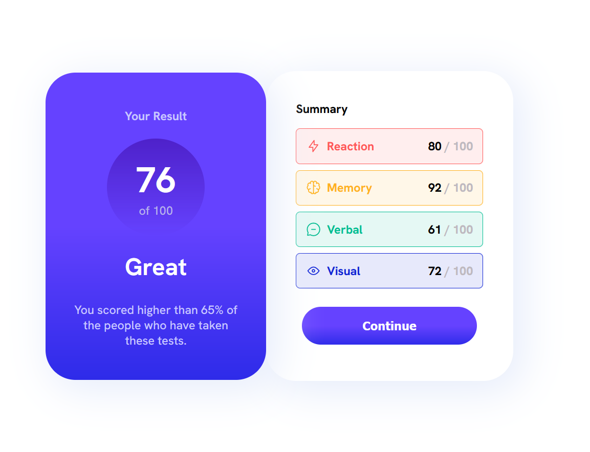

# Frontend Mentor - Result summary component solution

This is a solution to the [Four card feature section challenge on Frontend Mentor](https://www.frontendmentor.io/challenges/four-card-feature-section-weK1eFYK). Frontend Mentor challenges help you improve your coding skills by building realistic projects.

## Table of contents

- [Screenshot](#screenshot)
- [Links](#links)
- [My process](#my-process)
  - [Built with](#built-with)
  - [What I learned](#what-i-learned)
  - [Continued development](#continued-development)
- [Author](#author)
- [Acknowledgments](#acknowledgments)

## Overview

### My Solution To Result Summary Component Card

### Screenshot

## My process

I started bringing the design to live by laying out the structure of the html, using some semantic tags and then I created a design system in my css file using css variable to store the font families, weights, and sizes.

I also added the colors used in the design to the variable so that it will be easy to switch the different colors I needed when styling a particular component of the page.

It was fun and frustrating at some point to get the page to look exactly like the design, cause I was following a video to code along during which after applying certain styles to the page everything just breaks but having understood that it is when I break things and fix them, I boost my problem solving skills having to know what to do next time that I am faced with that kind of a problem.

Building this project took a lot of time as i started it last year, and being able to make it look closely to the design given is a success for me and a happy one too. Looking forward to building much more better projects this year.🚀💯

I am happy that I was able to finish up this project cause i learnt a lot, now I have an idea of what to do when working on a new project.

### Built with

- Html5
- CSS custom properties
- Flexbox

### What I learned

I learnt a lot while working on this project. The summary of all I learnt is this project made me understand and know what to do when creating a website or page after seeing the design, it made me know how i needed to structure the html of a given project before styling begins and then the things that nedded to be put in place before working on a certain project.

### Continued development

The plans I have for myself as i continue this software journey are to solidify my knowledge of web languages by building more projects and then learning frameworks that make building web applications easier and then keeping on working and improving my problem solving skills as a software engineer🚀✅

## Author

- Frontend Mentor - [@Ask4mike](https://www.frontendmentor.io/profile/Ask4mike)
- Twitter - [@mikael_akpang](https://www.twitter.com/mikael_akpang)

## Acknowledgments

I am giving a shout out the creators of frontend mentor for giving such a platform for people to learn and build a career in the world of software.
